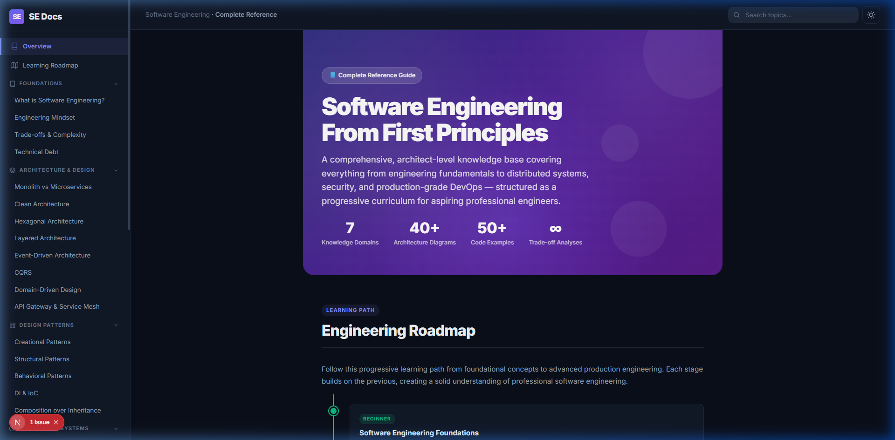
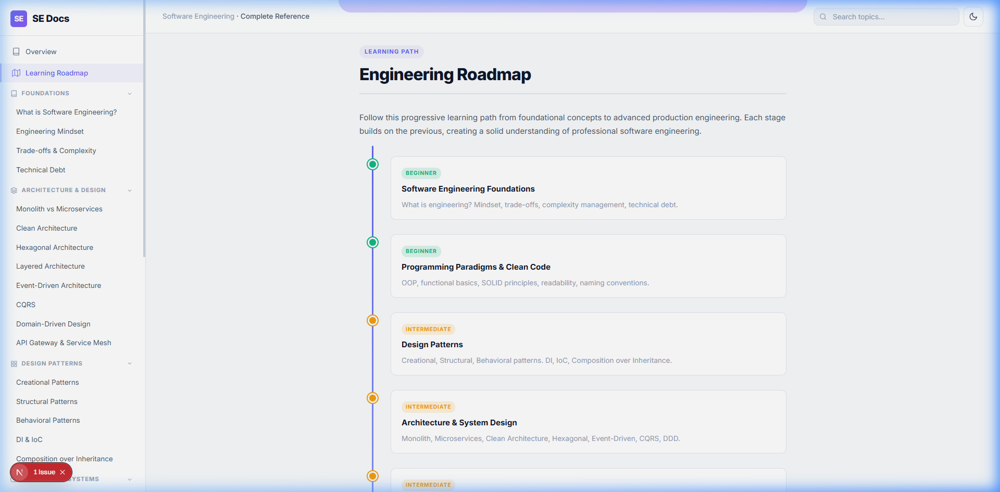
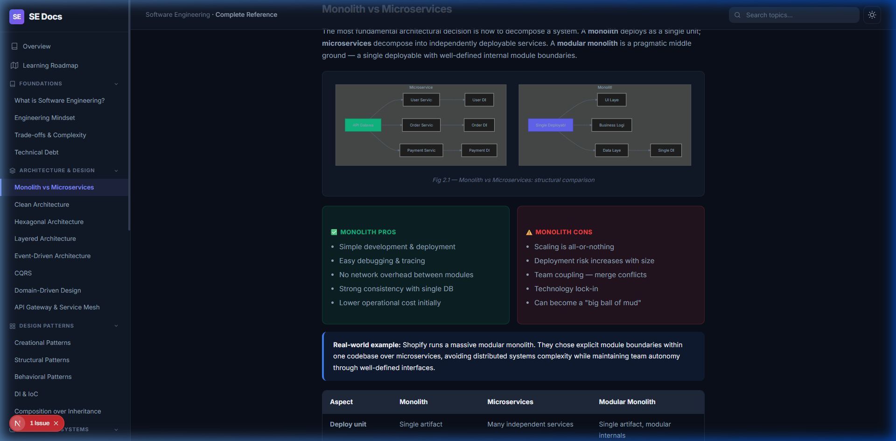
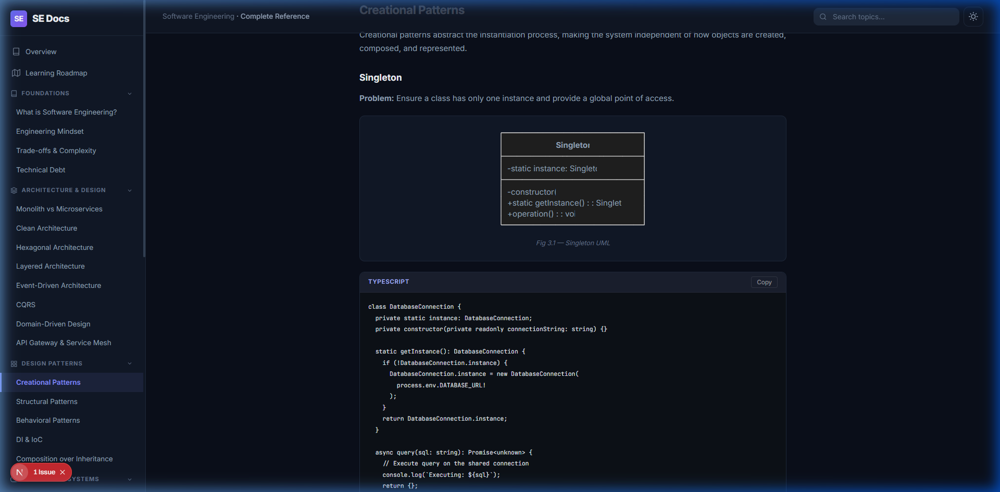
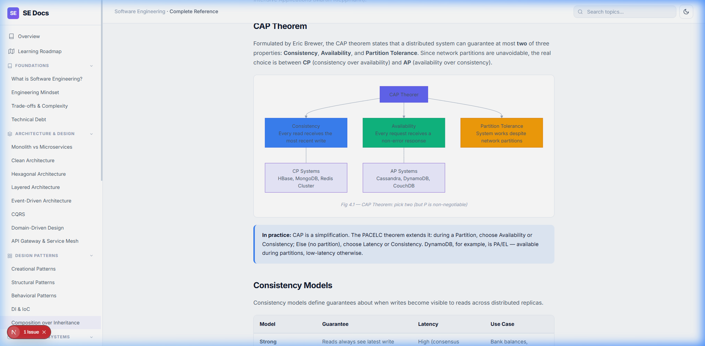
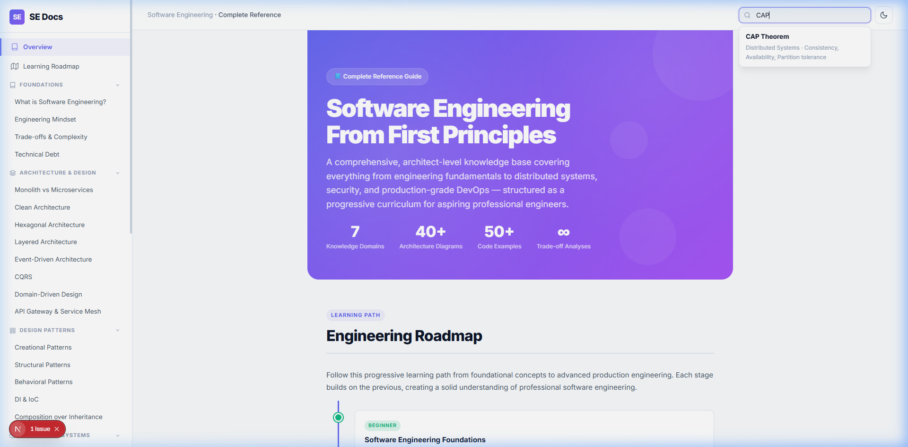

# SE Docs — Software Engineering From First Principles

A comprehensive, architect-level documentation SPA covering the full foundation required to become a professional software engineer.

Built with **Next.js 16**, **TypeScript**, **Mermaid.js**, and pure CSS.

---

## 📸 Screenshots

### Hero Section (Dark Mode)


### Learning Roadmap


### Architecture — Monolith vs Microservices


### Design Patterns — Code Examples


### Light Mode — CAP Theorem


### Search Functionality


---

## 🧠 Knowledge Domains

| # | Domain | Topics |
|---|--------|--------|
| 01 | **Foundations** | Engineering mindset, trade-offs, complexity, technical debt |
| 02 | **Architecture** | Monolith, Microservices, Clean, Hexagonal, Event-Driven, CQRS, DDD |
| 03 | **Design Patterns** | Creational, Structural, Behavioral, DI/IoC, Composition |
| 04 | **Distributed Systems** | CAP theorem, consistency, scaling, circuit breaker, Kafka, Redis, K8s |
| 05 | **Databases** | SQL vs NoSQL, indexing, transactions, sharding, event sourcing |
| 06 | **DevOps** | CI/CD, Blue-Green, Canary, IaC, observability, SRE |
| 07 | **Security** | OWASP Top 10, OAuth2, JWT, RBAC, Zero Trust |

## ✨ Features

- 🎨 **Dark / Light theme** with localStorage persistence
- 🔍 **Full-text search** across all topics
- 📊 **40+ Mermaid diagrams** (component, sequence, ER, state machine)
- 💻 **TypeScript code examples** with copy-to-clipboard
- 📋 **Comparison tables**, pros/cons cards, callouts
- 📌 **Sidebar navigation** with active section tracking
- 📱 **Responsive layout** with mobile sidebar

## 🚀 Getting Started

```bash
# Install dependencies
npm install

# Start dev server
npm run dev

# Production build
npm run build
```

Open [http://localhost:3000](http://localhost:3000) in your browser.

## 📁 Project Structure

```
src/
├── app/
│   ├── globals.css           # Design system (CSS custom properties)
│   ├── layout.tsx            # Root layout + ThemeProvider
│   └── page.tsx              # Main SPA page
├── components/
│   ├── CodeBlock.tsx          # Syntax-highlighted code blocks
│   ├── MermaidDiagram.tsx     # Theme-aware Mermaid renderer
│   ├── Navbar.tsx             # Top navbar with search
│   ├── Sidebar.tsx            # Hierarchical sidebar nav
│   └── ThemeProvider.tsx      # Dark/light theme context
├── content/
│   ├── Hero.tsx               # Hero section
│   ├── Roadmap.tsx            # Learning roadmap
│   ├── Foundations.tsx        # Module 01
│   ├── Architecture.tsx       # Module 02
│   ├── DesignPatterns.tsx     # Module 03
│   ├── DistributedSystems.tsx # Module 04
│   ├── Databases.tsx          # Module 05
│   ├── DevOps.tsx             # Module 06
│   └── Security.tsx           # Module 07
└── data/
    ├── navigation.ts          # Sidebar nav tree
    └── searchIndex.ts         # Search index
```

## 📚 References

- *Clean Architecture* — Robert C. Martin
- *Designing Data-Intensive Applications* — Martin Kleppmann
- *Design Patterns: Elements of Reusable Object-Oriented Software* — GoF
- OWASP Foundation — [owasp.org](https://owasp.org)
- Google SRE Book — [sre.google](https://sre.google)
